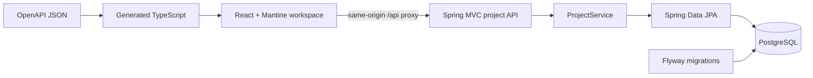

# Architecture

## Privacy/terms disclosure routes

App renders static `/privacy` and `/terms` routes and a shared footer. Legal content
uses plain-text public build-time settings from `apps/web/.env.example`; missing
facts remain visible TODOs. UploadDisclosure is reused once per upload form. These
pages perform no API/provider request and introduce no storage, consent or lifecycle
subsystem. Production edge/static fallback is operator-managed externally, per
Patrick; it was not inspected or modified here. See [deployment notes](DEPLOYMENT.md).

## PR10 security boundary

V11 PaidRunAdmission reserves a logical paid attempt in the existing run transaction
under a deployment-wide PostgreSQL lock. Project lifecycle cannot erase its 24-hour
window. Replays bypass new admission; failures after admission retain the slot.
PAID_RUNS_ENABLED disables new work, not saved-result access. ADR-0011 records policy.
PaidWorkGate bounds actual workers within one process, including expired-but-live
workers; existing database global-active checks remain cross-process admission.

HttpSafetyFilter precedes MVC/multipart parsing: global bounded request buckets,
one upload/demo preparation, 64 KiB JSON bound, same-origin mutation checks, no-store
and defensive API headers. Tomcat connections/threads and database acquisition/locks
are bounded. LocalMediaStorage validates canonical identity and free-space reserves;
derived staging/unpublished segment cleanup is compensated after ordinary failures.
No authentication, public isolation or distributed filesystem guarantee is added.
Exact settings, verification and static-host requirements: PR10-REVIEW.

## PR9 boundaries

PR8 provider models, schema, orchestration, retries, limits and creator authority are
unchanged. React FilmProgress derives workflow states from saved stages/timestamps;
no backend progress model, ETA engine or SSE is added. SourceProvenance matches the
existing source SHA-256 against packaged manifest metadata. InspectionTimeline owns
ephemeral In/Out state; no range is sent to any API or persisted as analysis input.

The sole backend domain extension is ordinary-project deletion: ProjectController
→ ProjectDeletionService → existing MediaStorage. V10 adds UUID-only cleanup records,
project-owned cascading FKs and the narrow deleted-parent history exception.
Metadata deletion commits before filesystem cleanup; failures remain explicitly
retryable. Demo copies retain PR7 replacement/retention. [ADR-0010](adr/ADR-0010-project-deletion.md)
records storage boundaries and limitations; [PR10 plan](PR10-SECURITY-PLAN.md) is
preparation only, not implementation or a claim of public deployment safety.

## Implemented foundation

One monorepo: `apps/api` Kotlin/Spring Boot; `apps/web` React/TypeScript;
`packages/api-client` OpenAPI document, generated types and typed fetch functions.
Root Gradle configuration builds the API; npm workspaces build the web/client.
`docker-compose.yml` runs only PostgreSQL with a dedicated named persistent volume.

Project packages contain HTTP DTOs/controller, transactional service, entity and
repository. API error advice uses RFC 9457 ProblemDetail and does not expose internal
exception messages. Bean validation bounds strings and page numbers. Unknown JSON
fields and malformed requests fail. `GET /actuator/health` includes database health
without details; the packaged OpenAPI document is served at `/openapi.json`.
Problem `type` can be omitted by Spring for generic HTTP errors, meaning `about:blank`
under [RFC 9457](https://datatracker.ietf.org/doc/html/rfc9457#section-3.1.1);
specific missing-project errors have a stable SceneProof URN.

## Persistence and runtime

`projects` stores UUID, name, description, textual project rules and timestamps.
Flyway V1 owns schema creation; Hibernate uses `validate` and open-in-view is off.
Project reads use transactions and DTOs. Newest-first listing is paginated, with ID
as a deterministic secondary sort. Integration tests use separate `sceneproof_test`
schema and roll back; no H2 substitute. Rules remain bounded text until reference
and intentional-change semantics need normalized scope/history.

Default local topology: browser on 127.0.0.1:5173 → Vite proxy → API on
127.0.0.1:8085 → PostgreSQL host port 55432. No wildcard CORS, no anonymous public
deployment claim. Docker credentials are development defaults. `.env` is ignored;
Compose reads it, while directly launched Java requires exported environment values.

## Implemented media ingestion (PR1)

MediaWorkspace uploads multipart through the typed API client, lists persisted
shots and selects normalized frames. MediaController delegates to MediaService,
MediaStorage/LocalMediaStorage, ImageNormalizer and FfmpegAdapter. MediaProcess
bounds executable runtime and output. MediaRepository uses Spring JDBC against
the existing datasource, with project-row locking for atomic shot/frame metadata
writes. Flyway V2 owns these tables. Decoding occurs outside DB transactions.
Final READY/FAILED states are persisted; binary files stay outside PostgreSQL.

Project membership checks precede PNG delivery; client names never become paths.
Normal failures clean media; abrupt termination may leave unreferenced files.
Exact limits and cleanup: [Media pipeline](MEDIA-PIPELINE.md),
[ADR-0003](adr/ADR-0003-local-media-ingestion.md).

## Implemented Astra analysis (PR2)

AnalysisController → AnalysisService → ContinuityAnalysisPort →
AstraContinuityAnalysisAdapter → JDK HTTP Responses endpoint. The domain-facing
port returns typed results and usage; application validation rechecks evidence scope.
No OpenAI SDK/Spring AI transport types enter controllers or the domain. Context
assembly reuses ProjectService, MediaRepository and MediaStorage from PR1.
Flyway V3 adds analysis_runs, findings, finding_shots and finding_frames. JDBC
transactions commit RUNNING before provider work, then atomically persist all
validated findings with SUCCEEDED. Failures use separate short transactions.
Request UUID uniqueness prevents replayed client calls; one RUNNING DB index and
an in-process semaphore bound work. Five-minute lazy stale-run recovery never
replays model calls. The API remains synchronous/local with no workers or UI changes.
Selected context stores only bounded metadata/hashes, never duplicate image bytes.
See [Astra integration](ASTRA-INTEGRATION.md) and [ADR-0004](adr/ADR-0004-astra-responses-api-integration.md).

## Implemented findings workspace (PR3)

Workspace composes FindingsWorkspace beside the existing reference panel.
FindingsWorkspace owns URL selection, paginated findings queries, optional linked
analysis status and frame navigation. MediaWorkspace shares the existing shots
query key through TanStack Query and preserves import/normal inspection behavior.
EvidenceComparison joins generated Finding/Shot/Frame types by persisted IDs;
no parallel DTOs or provider SDK enters React. All findings/status queries are GETs.
Selecting a finding scopes its URL to its immutable analysis, making reload stable
when newer runs exist. No latest-run endpoint or automatic model orchestration is added.

The browserTestServer Gradle task uses a test-only primary ContinuityAnalysisPort,
real PR2 services and PostgreSQL in sceneproof_browser, plus separate local media.
Its marker prevents E2E fixture creation against a normal provider server. Test
classes/configuration are excluded from the production jar. No runtime backend,
API contract, migration or Astra adapter change was needed for PR3.

## Implemented targeted steering (PR4)

FindingActionController → FindingActionService → ContinuityAnalysisPort.reanalyze →
the existing Astra adapter and JDK Responses transport. A typed TargetedContext and
TargetedCompletion keep provider HTTP types out of the application boundary. The
original analyze operation retains PR2 sampling; PR5 extends its prompt/schema
with optional typed references and validated citations.

V4 adds finding_actions, finding_action_shots, targeted_results, immutable-history
triggers, and finding_current_state. AnalysisRun.kind identifies SEQUENCE/TARGETED.
Action admission takes the existing transaction advisory lock and locks the finding;
intent reserves an AnalysisRun in the same short transaction. The existing unique
RUNNING index bounds all sequence and targeted provider work globally. Resolve and
dismiss write only an action. Model work holds no PostgreSQL transaction. Validated
targeted result and run success commit atomically; effective status is a read
projection, so failed finalization cannot partially supersede the old judgement.

React FindingActions consumes the generated contract, keeps an unresolved request
in sessionStorage before POST, and refreshes findings/history through GET. Original
finding IDs, URL selection and evidence stay stable. Latest judgement is distinct
from original fields; history shows all actions including failures. Normal tests
stub the port. PR4 persistence tests use a dedicated sceneproof_steering_test schema
and explicitly truncate only that test schema's fixture tables between tests.
See [ADR-0005](adr/ADR-0005-immutable-finding-steering.md).

## Implemented Reference Bible (PR5)

ReferenceController → ReferenceService/ReferenceRepository reuses PR1 MediaStorage,
ImageNormalizer and extracted ImageContent bounded copy/signature/normalized reads.
MediaIngestionGate shares decoder admission with shots. Reference UUID directories
never require Shot/Frame rows. Short project-lock transactions admit eight active
and 100 lifetime references; decoding remains outside transactions. V5 adds
visual_references, analysis_references and finding_references. Immutable image
identity and append-only submitted snapshots preserve auditability across archive.

AnalysisContextAssembler selects all active references once in deterministic order,
or original cited snapshots for targeted review. It checks PNG decode, dimensions
and reference hash before provider work; images share the frame aggregate budget.
AnalysisRepository writes context/submitted-reference rows before inference, then
findings/associations/success atomically. Composite foreign keys require citations
to belong to that project's submitted run. The adapter separates reference images
from sequence evidence and preserves deadlines, retries and reasoning settings.

React ReferenceBible uses the generated client. FindingReferences reads historical
submitted metadata independently of current Bible queries. Cache updates follow
successful responses; load/upload/save/archive/image failures remain explicit.
No edit hook initiates Astra. Tests use reference-test and browser-test schemas.
See [ADR-0006](adr/ADR-0006-reference-bible-history.md).

## Implemented guided tour (PR6)

PR6 `GuidedTour` is composed in the existing workspace toolbar. Its four fixed
steps use explicit `data-tour` markers on ReferenceBible, MediaWorkspace and the
FindingsWorkspace panel. Mantine owns modal semantics/focus trapping; local React
state owns navigation. A versioned localStorage string records only skipped/completed
onboarding, independent of Project and the generated API client. No backend, DB,
OpenAPI, provider or dependency changes are introduced. See UX for focus/fallbacks.

## Implemented demo lifecycle (PR7)

DemoController → DemoService → packaged DemoTemplateSource → existing ProjectService,
ReferenceService and MediaService. PR7 copied only `demo/runtime`; PR8 additionally
packages the immutable original as `demo/source-film.mp4` for provenance and the
derived 0–36.291667-second `demo/analysis-source.mp4` for new/reset SourceFilm ingestion.
Authoring notes and evaluation manifests remain excluded from application resources.
V6 adds explicit instance/version/retirement identity and replacement mapping.
An instance advisory lock and bounded seed transaction publish a complete project
or roll back. Reset creates new domain data and retains historical copies unchanged.
This curated operation deliberately holds a transaction during decoding; ordinary
uploads retain their existing short transactions. Details and compensation limits:
[ADR-0007](adr/ADR-0007-demo-template-and-replacement.md).

React DemoLaunch persists a request UUID in sessionStorage before calling the typed
API; pending state guards double clicks and failures reuse the same UUID. DemoReset
confirms consequences, disables duplicate actions and navigates only after success.
Workspace identity comes from Project.demo, never its name. Bible/timeline/evidence
remain existing components reading real persisted API data. No analysis is started.

## Boundaries reserved for later slices (unchanged)

General job orchestration remains deferred; PR8's bounded durable worker is below.
Raw media stays outside PostgreSQL.
Spring AI is not loaded: the verified Responses transport uses JDK HTTP (ADR-0004).

Public hosting, durable media mounts, anonymous project isolation and live-analysis
limits need a separate deployment decision. This baseline is local development.

Concrete versions and run commands: [README](../README.md). Decisions:
[ADR-0001](adr/ADR-0001-foundation-stack.md), [ADR-0002](adr/ADR-0002-openapi-client.md).

## PR8 bounded Film Understanding

FilmController → SourceFilmService / FilmUnderstandingService → FilmRepository,
AudioTranscriptionPort and FilmUnderstandingPort. The two concrete OpenAI adapters
are separate from ContinuityAnalysisPort. Responses transport is shared plumbing,
not a shared interpretation/provider interface. No Spring AI or queue dependency.

POST reserves a durable run/stage in a short transaction, then starts one virtual
thread. Source verification, real FFmpeg extraction, transcription, multimodal
understanding and candidate validation each have a committed stage before work.
Success plus candidates is atomic; database conditional updates reject late writes.
Provider operations occur outside transactions and are never automatically retried.

The database advisory admission lock is shared with sequence/targeted runs; a unique
index also enforces one active Film Understanding run. GET/start lazily marks runs
older than ten minutes FAILED with FILM_INTERRUPTED. Restart does not replay workers
or paid calls; the saved stage remains visible until that recovery deadline. This is
durable observation/recovery, not guaranteed background execution after process loss.

The frontend polls GET every 1.5 seconds while active or reconciling a submitted UUID.
SSE adds unnecessary connection/event recovery work for this bounded local flow.
Session storage records the paid request before POST; recovery reuses its exact UUID
and source, while a new attempt requires new consent. Backend timestamps/stages are
authoritative. No percentages, timers predicting completion or model-thought display.

V7 adds six normalized film tables, including candidate decisions,
and finding evidence JSON; bounded nested discovery stays a strict JSON document.
V8 adds decision/result integrity and same-project reference provenance constraints.
V9 changes only new transcription model/time-origin defaults to the one-call diarized
Audio Transcriptions contract. No local multi-call chunking, speaker domain or
Chat/Responses transcription is introduced; see [ADR-0009](adr/ADR-0009-timed-audio-transcription.md).
Media remains outside PostgreSQL. Staged frame directories may remain after failures;
there is no new disk GC. Transcript API reads are no-store; generic exception logs
exclude messages/causes that could contain SQL row data. This is not public tenancy.
