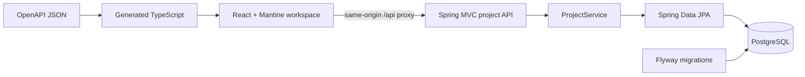

# Architecture

## Implemented foundation

One monorepo: `apps/api` Kotlin/Spring Boot; `apps/web` React/TypeScript;
`packages/api-client` OpenAPI document, generated types and typed fetch functions.
Root Gradle configuration builds the API; npm workspaces build the web/client.
`docker-compose.yml` runs only PostgreSQL with a dedicated named persistent volume.

Project packages contain HTTP DTOs/controller, transactional service, entity and
repository. API error advice uses RFC 9457 ProblemDetail and does not expose internal
exception messages. Bean validation bounds strings and page numbers. Unknown JSON
fields and malformed requests fail. `GET /actuator/health` includes database health
without details; the packaged OpenAPI document is served at `/openapi.json`.
Problem `type` can be omitted by Spring for generic HTTP errors, meaning `about:blank`
under [RFC 9457](https://datatracker.ietf.org/doc/html/rfc9457#section-3.1.1);
specific missing-project errors have a stable SceneProof URN.

## Persistence and runtime

`projects` stores UUID, name, description, textual project rules and timestamps.
Flyway V1 owns schema creation; Hibernate uses `validate` and open-in-view is off.
Project reads use transactions and DTOs. Newest-first listing is paginated, with ID
as a deterministic secondary sort. Integration tests use separate `sceneproof_test`
schema and roll back; no H2 substitute. Rules remain bounded text until reference
and intentional-change semantics need normalized scope/history.

Default local topology: browser on 127.0.0.1:5173 → Vite proxy → API on
127.0.0.1:8085 → PostgreSQL host port 55432. No wildcard CORS, no anonymous public
deployment claim. Docker credentials are development defaults. `.env` is ignored;
Compose reads it, while directly launched Java requires exported environment values.

## Implemented media ingestion (PR1)

MediaWorkspace uploads multipart through the typed API client, lists persisted
shots and selects normalized frames. MediaController delegates to MediaService,
MediaStorage/LocalMediaStorage, ImageNormalizer and FfmpegAdapter. MediaProcess
bounds executable runtime and output. MediaRepository uses Spring JDBC against
the existing datasource, with project-row locking for atomic shot/frame metadata
writes. Flyway V2 owns these tables. Decoding occurs outside DB transactions.
Final READY/FAILED states are persisted; binary files stay outside PostgreSQL.

Project membership checks precede PNG delivery; client names never become paths.
Normal failures clean media; abrupt termination may leave unreferenced files.
Exact limits and cleanup: [Media pipeline](MEDIA-PIPELINE.md),
[ADR-0003](adr/ADR-0003-local-media-ingestion.md).

## Implemented Astra analysis (PR2)

AnalysisController → AnalysisService → ContinuityAnalysisPort →
AstraContinuityAnalysisAdapter → JDK HTTP Responses endpoint. The domain-facing
port returns typed results and usage; application validation rechecks evidence scope.
No OpenAI SDK/Spring AI transport types enter controllers or the domain. Context
assembly reuses ProjectService, MediaRepository and MediaStorage from PR1.
Flyway V3 adds analysis_runs, findings, finding_shots and finding_frames. JDBC
transactions commit RUNNING before provider work, then atomically persist all
validated findings with SUCCEEDED. Failures use separate short transactions.
Request UUID uniqueness prevents replayed client calls; one RUNNING DB index and
an in-process semaphore bound work. Five-minute lazy stale-run recovery never
replays model calls. The API remains synchronous/local with no workers or UI changes.
Selected context stores only bounded metadata/hashes, never duplicate image bytes.
See [Astra integration](ASTRA-INTEGRATION.md) and [ADR-0004](adr/ADR-0004-astra-responses-api-integration.md).

## Boundaries reserved for later slices

Analysis jobs/progress transport, findings workspace UI, reference editing and
intentional-change steering remain planned. Raw media stays outside PostgreSQL.
Spring AI is not loaded: the verified Responses transport uses JDK HTTP (ADR-0004).

Public hosting, durable media mounts, anonymous project isolation and live-analysis
limits need a separate deployment decision. This baseline is local development.

Concrete versions and run commands: [README](../README.md). Decisions:
[ADR-0001](adr/ADR-0001-foundation-stack.md), [ADR-0002](adr/ADR-0002-openapi-client.md).
